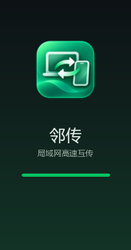

<div align="center">
  
  <h1>邻传 · Nearby Transfer</h1>
  <p><strong>让文件，在你的设备之间自由流动。</strong></p>
  <p>Windows 电脑与 Android 手机的局域网高速互传工具</p>

  <a href="https://github.com/ShiyouQi888/Nearby-Transfer/releases/tag/v1.0.0">下载最新版</a>
  ·
  <a href="https://linchuan.aeback.com">官方网站</a>
  ·
  <a href="https://github.com/ShiyouQi888/Nearby-Transfer/issues">问题反馈</a>
</div>

<br />



## 产品简介

邻传是一款专注于局域网互传的跨设备工具。电脑与手机连接同一个 Wi‑Fi 后，即可完成配对、发送和接收；文件直接在设备之间传输，不经过第三方服务器，也不上传云端。

它适合日常办公、素材整理、手机照片备份、视频传输、安装包传递，以及需要快速交换文件的团队协作场景。

## 核心亮点

- **局域网直连**：数据只在本地网络内流动，速度快、隐私更安心。
- **双向传输**：Windows ↔ Android 均可发送和接收文件。
- **多种配对方式**：支持二维码、6 位匹配码和 IP 地址连接。
- **文件类型友好**：图片、视频、音频、文档、压缩包、APK、文件夹和批量文件均可传输。
- **接收可控**：接收方必须确认后才开始传输，避免误收文件。
- **大文件可靠传输**：支持分片传输、实时进度、速度显示、断点续传和中途取消。
- **设备管理**：保存历史设备，支持快捷发送和删除设备记录。
- **品牌化体验**：Windows 端采用统一深色设计系统，Android 端为原生应用，安装器和通知使用统一品牌视觉。

## 下载与安装

当前版本：**v1.0.0**

| 平台 | 下载 | 说明 |
|---|---|---|
| Windows | [Nearby-Transfer-Setup-1.0.0.exe](https://github.com/ShiyouQi888/Nearby-Transfer/releases/download/v1.0.0/Nearby-Transfer-Setup-1.0.0.exe) | Windows x64 安装包 |
| Android | [Nearby-Transfer-v1.0.0-debug.apk](https://github.com/ShiyouQi888/Nearby-Transfer/releases/download/v1.0.0/Nearby-Transfer-v1.0.0-debug.apk) | Android APK |

### 使用前提

1. Windows 电脑和 Android 手机连接到同一个局域网。
2. 首次启动 Windows 端时，允许软件配置局域网防火墙权限。
3. 如果路由器开启了“AP 隔离 / 客户端隔离”，请关闭该功能。
4. VPN、虚拟网卡或访客 Wi‑Fi 可能会阻止设备发现。

## 三步开始传输

### 1. 打开电脑端

启动邻传 Windows 端，在“配对”页面查看二维码或 6 位匹配码。

### 2. 连接手机

打开 Android 端，选择以下任意方式：

- 扫描电脑端二维码；
- 输入电脑 IP 和 6 位匹配码；
- 在支持的网络环境下扫描在线设备。

### 3. 选择文件并发送

选择文件或文件夹，在目标设备选择器中选择在线设备，点击发送即可。接收文件时，对端需要点击“确认接收”。

## 安全与隐私

- 不依赖外网服务器，不上传用户文件。
- 未配对设备不能建立传输会话。
- 接收方明确确认后才会写入文件。
- 支持二维码临时令牌和 6 位匹配码配对。
- 配对成功后使用长期令牌快速连接。
- 接收路径会进行安全清洗，阻止 `../` 路径穿越。
- Windows 防火墙仅放行邻传所需的局域网端口：TCP/UDP `53317`，并优先限制在专用/域网络。

## 技术架构

### Windows 电脑端

- Electron 33
- Node.js 原生 `net` / `dgram`
- TCP 文件传输与 UDP 设备发现
- NSIS Windows 安装包
- 主进程负责网络、文件和系统能力，渲染进程负责界面

### Android 手机端

- 原生 Android Java 应用
- 原生 TCP Socket 文件传输
- 原生 UDP 局域网设备发现
- ZXing 二维码扫描
- Android 系统文件选择器
- MediaStore / 下载目录文件落盘

### 共享协议

`shared/protocol.js` 是 LTP/1 协议的单一事实来源，统一定义设备发现、配对认证、NDJSON 信令、文件分片、进度、取消、拒绝和完成状态。

主要端口：

| 用途 | 端口 |
|---|---:|
| TCP 文件与信令 | `53317` |
| UDP 设备发现 | `53317` |
| HTTP / WebSocket 网关 | `53318` |

## 项目结构

```text
Nearby-Transfer/
├── desktop/                 # Windows Electron 电脑端
│   ├── src/main/             # 网络服务、发现、传输、配置
│   ├── src/preload/          # 安全 IPC bridge
│   ├── src/renderer/         # 深色桌面界面
│   └── resources/            # 图标、安装器品牌资源
├── mobile/android/           # 原生 Android 应用
│   └── app/src/main/java/    # MainActivity、NativeClient、NativeDiscovery
├── shared/                   # LTP/1 共享协议
├── docs/                     # 协议与开发文档
└── scripts/                  # 测试、构建和校验脚本
```

## 本地开发

### Windows 端

```bash
cd desktop
npm install
npm start
```

### Android 端

需要 Android SDK、JDK 17+ 和 Gradle 环境：

```bash
cd mobile/android
./gradlew assembleDebug
```

生成的 APK 位于：

```text
mobile/android/app/build/outputs/apk/debug/app-debug.apk
```

### 测试

```bash
node scripts/test-protocol.js
node scripts/test-e2e.js
```

当前协议测试与端到端测试均已通过。

## 关于

| 项目 | 内容 |
|---|---|
| 作者 | **齐世有** |
| 电子邮箱 | [blacklaw@foxmail.com](mailto:blacklaw@foxmail.com) |
| 官网 | [https://linchuan.aeback.com](https://linchuan.aeback.com) |
| GitHub | [ShiyouQi888/Nearby-Transfer](https://github.com/ShiyouQi888/Nearby-Transfer) |

## 许可证与声明

邻传 Nearby Transfer © 2026 齐世有。保留所有权利。

项目中使用的字体和第三方依赖遵循其各自的开源许可证。详细协议说明见 [`docs/PROTOCOL.md`](docs/PROTOCOL.md)。

<div align="center">
  <br />
  <strong>邻传 · 简单、安全、高效</strong>
  <br />
  <sub>让文件在设备间自由流动</sub>
</div>
